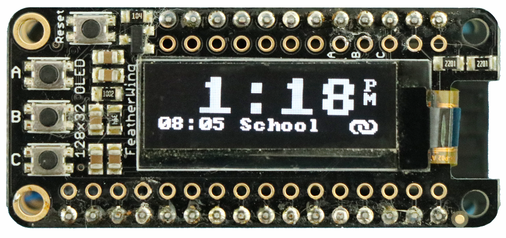
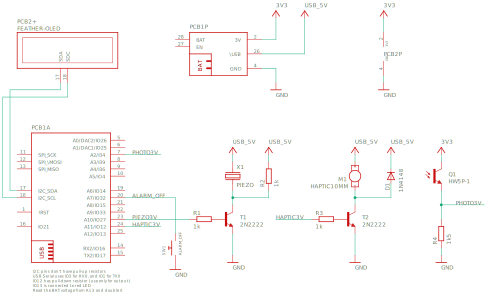
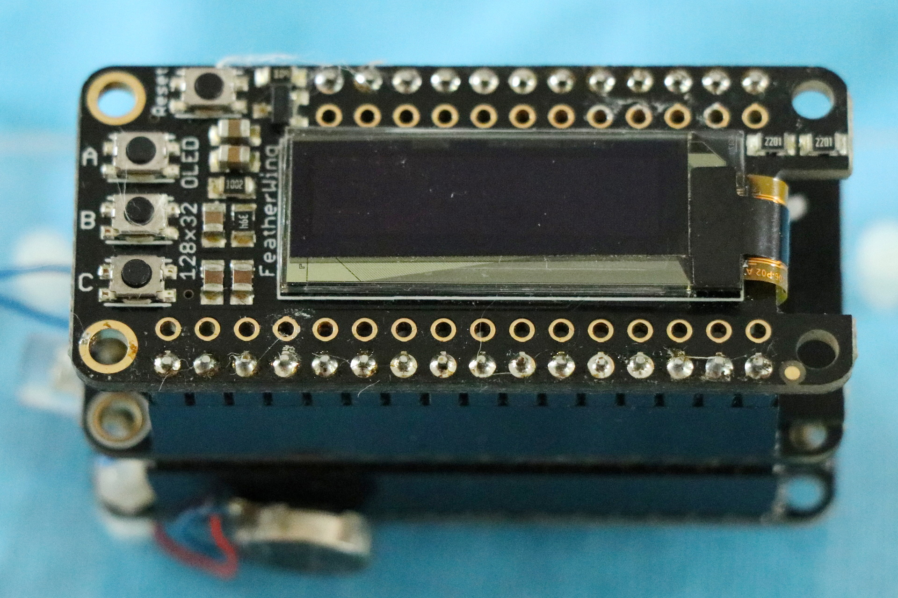

# CALalarm

[](https://github.com/cvonk/CALalarm/discussions)


## There is no better feeling than not having to set an alarm



ESP32 OLED alarm clock that syncs with Google Calendar.

Features:

  - [x] Shows the time and first event of the day.
  - [x] Learns the alarm time from Google Calendar.
  - [x] Piezo and/or haptic to wake you up.
  - [x] Button stops the noise.
  - [x] Open source!

## Software

Clone the repository and its submodules to a local directory. The `--recursive` flag automatically initializes and updates the submodules in the repository.  Start with a fresh clone, and copy the `Kconfig.example`.

```bash
git clone https://github.com/cvonk/CALalarm.git
cd CALalarm/alarm
cp alarm/main/Kconfig.example alarm/main/Kconfig
```

### Google Apps Script

The software is a symbiosis between [Google Apps Script](https://developers.google.com/apps-script/guides/web) and firmware running on the ESP32. The script reads the alarm event from your Google Calendar and presents it as JSON to the ESP32 device.

To create the Web app:
  - Create a new project on [script.google.com](https://script.google.com);
  - Rename the project to e.g. `CALalarm_doGet`
  - Copy and paste the code from `script\Code.js`
  - Add the `Google Calendar API` service .
  - Select the function `test` and click `Debug`. This will ask for permissions. There will not be any output.
  - Click `Deploy` and chose `New deployment`, choose
    - Service tye = `Web app`
    - Execute as = `Me`
    - Who has access = `Anyone`, make sure you understand what the script does!
    - Copy the Web app URL to the clipboard

Open the URL in a web browser. You should get a reply like
```json
{
    "time": "2022-04-20 12:56:37",
    "pushId": "some_id_or_not",
    "events": [
        { 
            "start": "2022-04-20 10:30:00",
            "end": "2022-04-20 15:45:00",
            "title": "School"
        },
    ]
}
```

Then, paste the URL to `alarm/main/Kconfig` as the value of `CALALARM_GAS_CALENDAR_URL`.

As we see in the next sections, the ESP32 does a `HTTP GET` on this URL, to retrieve a list of upcoming events from your calendar.

### ESP32 Device

In `menuconfig`, scroll down to CALalarm and select "Use hardcoded Wi-Fi credentials" and specify the SSID and password of your Wi-Fi access point.

```bash
idf.py set-target esp32
idf.py menuconfig
idf.py flash
```

## Hardware

> :warning: **THIS PROJECT IS OFFERED AS IS. IF YOU USE IT YOU ASSUME ALL RISKS. NO WARRENTIES.**

### Schematic

Haptic motor `M1` draws 100 mA at 5 Volts.  The GPIO "on" voltage of the ESP32 is typically 3.1 Volt and can supply up to 20 mA. To drive the PN2222A transistor to saturation, we need a V<sub>be</sub> = 0.6 Volt. This implies that for I<sub>b</sub> of 2.5 mA, the base resistor `R3` should be 1 k&ohm;. Note that, diode `D1` protects for reverse back current due to the motor inductance.

The piezo buzzer `X1`, when driven with a 5 V<sub>pp</sub> 1 kHz square wave, also draws 100 mA. That implies that the base resistor `R1` should be 1 k&ohm; as well. We use resistor `R2`, to discharge the capacitive piezo element, as specified in the datasheet.

For the phototransistor `Q1`, the value for the current limiting resistor `R4` is taken from the test setup in its datasheet. 



### Bill of materials

| Name          | Description                                             | Sugggested mfr/part#       |
|---------------|---------------------------------------------------------|----------------------------|
| PCB1          | Feather Huzzah32 ESP32 (ESP-WROOM32)                   | [Adafruit 3619](https://www.digikey.com/en/products/detail/adafruit-industries-llc/3619/8119806?s=N4IgTCBcDaIIIBMCGAzATgVwJYBcAEAzAGwCMAnCALoC%2BQA)
| PCB2          | FeatherWing OLED, 128x32                                | [Adafruit 2900](https://www.digikey.com/en/products/detail/adafruit-industries-llc/2900/5810890?s=N4IgTCBcDaIIIBMCGAzATgVwJYBcAEYAnAAzEgC6AvkA)
| PROTO         | FeatherWing prototyping add-on                          | [Adafruit 2884](https://www.digikey.com/en/products/detail/adafruit-industries-llc/2884/5777193?s=N4IgTCBcDaIIIBMCGAzATgVwJYBcAEYAHIQCwgC6AvkA)
| M1            | Vibrating mini motor disc, 5V                           | [Adafruit 1201](https://www.digikey.com/en/products/detail/adafruit-industries-llc/1201/5353637?s=N4IgTCBcDaIIIBMCGAzATgVwJYBcAEAjGAAwEgC6AvkA)
| X1            | Piezo buzzer 5V AC, through hole                 | [Adafruit 160](https://www.adafruit.com/product/160) or [TDK PS1240P02BT](https://www.digikey.com/en/products/detail/tdk-corporation/PS1240P02BT/935930)
| T1, T2        | NPN transistor, 40V / 600mA, TO92-3                     | [NTE Electronics PN2222A](https://www.digikey.com/en/products/detail/nte-electronics-inc/PN2222A/11655004)
| Q1            | Phototransistor, HW5P-1                                 | [Adafruit 2831](https://www.digikey.com/en/products/detail/adafruit-industries-llc/2831/8323990?s=N4IgTCBcDaIIIBMCGAzATgVwJYBcAEYAHAMwCMIAugL5A)
| D1            | Diode, general purpose, 100V / 200mA, DO35                     | [onsemi 1N4148](https://www.digikey.com/en/products/detail/onsemi/1N4148/458603)
| R1 - R4    | Resistor, 1 k&ohm;, 1/4 W, axial                           | [Yageo CFR-25JT-52-1K](https://www.digikey.com/en/products/detail/yageo/CFR-25JT-52-1K/13921014)

Instead of the Feather products, you can probably also use a generic 0.96" OLED ESP-WROOM-32 development board.

### Putting it together

Assemble the circuit on the prototyping board. Then stack `PCB1` and `PCB2` on top of it.

 



## Feedback

I love to hear from you. Please use the Github discussions to provide feedback.
